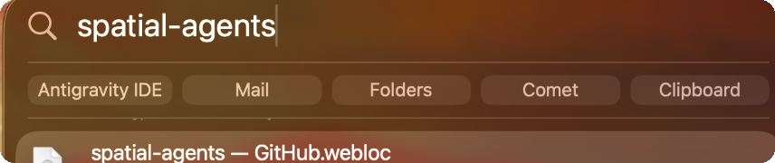

<div align="center">

# Launchpad

**Your repositories, natively integrated into macOS.**  
Launch live builds in two keystrokes. Reclaim gigabytes of idle disk space.  
*Zero resident daemons · 0 MB idle memory · Pure Python 3 standard library*

<br/>

```bash
# 1-Line Quick Install for macOS
curl -fsSL https://raw.githubusercontent.com/chama-x/launchpad/main/install.sh | bash
```

<br/>


</div>

---

## The Problem

If you keep dozens of repositories in `~/Projects`, you probably deal with the same three everyday frustrations:

1. **Storage bloat:** Inactive projects sit untouched for months, holding 50GB+ of throwaway `node_modules`, `.venv`, and build caches.
2. **Context switching:** To open a project's live staging site or GitHub page, you hunt through browser tabs, bookmarks, or terminal history.
3. **Invisible project state:** In Finder, every project folder looks identical. You cannot tell at a glance which projects are active, which are clean, and which have unpushed work.

Most developer tools try to solve this by running heavy Electron apps, Docker containers, or resident background daemons.

Launchpad takes a native approach: it connects your repositories directly to tools macOS already has—**Spotlight**, **Finder color tags**, and **Quick Look**.

---

## Native Capabilities

### 1. Instant Recall (`⌘Space`)
Launchpad generates lightweight `.webloc` shortcut files inside a disposable `Launchpad/` index. macOS Spotlight indexes them automatically:

* `⌘Space` $\rightarrow$ `project live` $\rightarrow$ `Return` opens the live deployment in Safari or Chrome.
* `⌘Space` $\rightarrow$ `project github` $\rightarrow$ `Return` opens the remote GitHub repository.

<div align="center">
  
</div>

### 2. Readiness at a Glance (Finder Tags)
Launchpad applies native macOS color tags (`libc.setxattr`) to each project folder:

* 🟠 **HOT (Orange):** Materialized repository with active dependencies (`node_modules`, `.venv`). Ready to run.
* 🟡 **WARM (Yellow):** Clean git commit tree with dependencies purged (~1–15 MB on disk).
* ⚪️ **COLD (Gray):** Remote GitHub metadata anchor (0 KB on disk). Not cloned locally until hydrated.
* 🟣 **Pinned (Purple):** Mission-critical or local-only projects permanently protected from automated decay.

### 3. Spacebar Documentation Previews
Every indexed project includes a rendered `README.html`. Tapping **Spacebar** in Finder opens an instant Quick Look preview without launching an editor or web browser.

### 4. Adaptive Storage: "Fat when working, lean when resting"
Launchpad automatically scales projects down as they sit idle:

* **After 21 days idle:** Automatically removes `node_modules` and build caches (`HOT` $\rightarrow$ `WARM`).
* **After 120 days idle:** Safely removes the clean local clone (`WARM` $\rightarrow$ `COLD`), keeping the project searchable in Spotlight.
* **Instant Hydration:** Run `launchpad hydrate <project>` (or right-click $\rightarrow$ **Quick Actions** $\rightarrow$ **Launchpad — Hydrate**) to re-clone and run frozen lockfile installs (`pnpm install`, `bun install`, `npm ci`, `cargo build`) in seconds.

---

## The Zero-Risk Guarantee: Your Code is Sacred

Launchpad will never delete, demote, or evict a project if:

1. `git status` shows untracked or modified files.
2. `git stash list` contains unapplied stashes.
3. `git log` shows unpushed commits on any local branch.

If any check fails, the project is flagged for attention and left untouched on disk.

Non-interactive `--force` calls (such as background scripts or automated AI tools) fail closed with exit code `1`. Force eviction strictly requires an interactive human in a terminal.

---

## Built for Humans. Engineered for Autonomous AI Agents.

Launchpad acts as the universal workspace harness for modern AI coding agents (Claude Code, Cursor, Gemini CLI, Antigravity):

* **`AGENTS.md` Workspace Contract:** Automatically placed at the workspace root (symlinked to `CLAUDE.md` and `GEMINI.md`) to establish rigid boundaries, safety rules, and CLI tools for AI agents.
* **Structured Context Cards:** Agents run `launchpad context <project>` to receive machine-readable JSON cards detailing runtime managers (`mise`, `volta`, `fnm`, `nvm`), lockfiles, and run recipes.
* **Collision-Free Port Allocator:** `launchpad run <project>` automatically probes port availability. If port 3000 is busy, it cleanly binds to 3001 with `PORT=3001`, preventing agent boot collisions.

---

## Terminal Experience & Command Reference

```bash
# Check workspace health, disk headroom, and project distribution
launchpad status

# Search across all local and remote indexed projects
launchpad search <query>

# Promote a cold project and install frozen dependencies
launchpad hydrate <project> [--hot]

# Start project on an auto-allocated collision-free port
launchpad run <project>

# Safely evict inactive project and reclaim disk space
launchpad evict <project>

# Protect a project permanently from automated decay
launchpad pin <project>

# Output machine-readable JSON context for AI tools
launchpad context <project>

# Reconcile metadata and upstream renames against GitHub
launchpad sync [--scan-local]

# System diagnostic report with privacy redaction mode
launchpad doctor [--redacted] [--json]
```

---

## Architecture & Separation

```
~/Projects/                      ← Workspace root ($LAUNCHPAD_HOME)
├── AGENTS.md                    ← Multi-agent contract (symlinked to CLAUDE.md & GEMINI.md)
├── .launchpad/                  ← Mode 0700 (Engine state — isolated from repos)
│   ├── manifest.json            ← Atomic state store (POSIX os.replace durability)
│   ├── config.json              ← Configurable thresholds and decay settings
│   ├── audit.jsonl              ← Append-only actor audit log
│   └── engine/launchpad.py      ← Pure Python 3 standard library engine
├── Launchpad/                   ← Generated human index (100% disposable)
│   └── <project>/
│       ├── <project> — Live.webloc
│       ├── <project> — GitHub.webloc
│       └── README.html
└── <project>/                   ← Pristine working trees (WARM / HOT)
```

---

## Verification

Launchpad includes a 20-test acceptance suite running in isolated temporary sandboxes with zero side-effects on your real system:

```bash
python3 tests/test_launchpad.py
```

Tested continuously on macOS 13, 14, and 15 (Sonoma & Sequoia) across Python 3.9 through 3.12.

---

## License

Released under the **[MIT License](LICENSE)**. Created and maintained by **[Chamath Thiwanka](https://github.com/chama-x)**.
