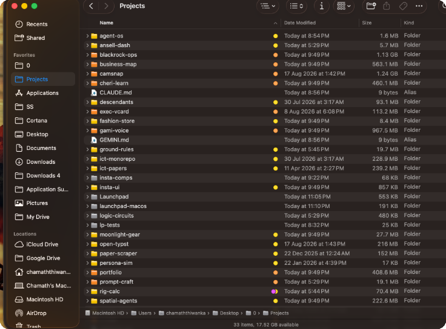

<div align="center">

# Launchpad

**The native workspace manager for macOS.**  
Turn Finder and Spotlight into your project launcher, status board, and disk lifecycle engine.

*Zero resident daemons · Zero background memory · Pure Python 3 standard library*

<br/>

```bash
# 1-Line Quick Install for macOS
curl -fsSL https://raw.githubusercontent.com/chama-x/launchpad/main/install.sh | bash
```

<br/>



</div>

---

## Why Launchpad?

If you keep dozens of Git repositories in `~/Projects`, you probably deal with three common frustrations:

1. **Storage bloat:** Inactive projects sit untouched for months, hoarding 50GB+ of throwaway `node_modules`, `.venv`, and build caches.
2. **Lost URLs & Context:** To open a project's live staging site or GitHub page, you search browser history or dig through bookmarks.
3. **Invisible Project State:** In Finder, every project folder looks identical. You cannot tell at a glance which projects have dependencies installed, which are clean, and which have unpushed commits.

Instead of running a heavy Electron app or background daemon, Launchpad solves this using native macOS primitives: **Spotlight**, **Finder color tags**, and **Quick Look**.

---

## How It Works

### 1. Spotlight Launching (`⌘Space`)
Launchpad generates lightweight `.webloc` shortcut files inside `Launchpad/<project>/`. macOS Spotlight indexes them automatically:

* `⌘Space` $\rightarrow$ `project live` $\rightarrow$ `Return` opens the live deployment in your browser.
* `⌘Space` $\rightarrow$ `project github` $\rightarrow$ `Return` opens the remote GitHub repository.

<div align="center">
  
</div>

### 2. Finder Readiness Tags
Launchpad applies native macOS color tags (`libc.setxattr`) to your project folders:

* 🟠 **HOT (Orange):** Materialized repository with active dependencies (`node_modules`, `.venv`). Ready to run.
* 🟡 **WARM (Yellow):** Clean Git commit tree with dependencies purged (~1–15 MB on disk).
* ⚪️ **COLD (Gray):** Remote GitHub metadata anchor (0 KB on disk). Not cloned locally until needed.
* 🟣 **Pinned (Purple):** Local-only or critical projects permanently protected from automated decay.

### 3. Spacebar Documentation Preview
Every indexed project includes a styled `README.html`. Tapping **Spacebar** in Finder opens an instant Quick Look preview without launching an editor or web browser.

### 4. Automated Disk Reclamation
Launchpad automatically sheds inactive dependencies over time:

* **21 days idle:** Removes `node_modules` and build caches (`HOT` $\rightarrow$ `WARM`).
* **120 days idle:** Removes the clean local clone (`WARM` $\rightarrow$ `COLD`), keeping the project searchable in Spotlight.
* **Instant Hydration:** Run `launchpad hydrate <project>` (or right-click in Finder $\rightarrow$ **Quick Actions** $\rightarrow$ **Launchpad — Hydrate**) to re-clone and execute frozen lockfile installs (`pnpm install`, `bun install`, `npm ci`, `cargo build`) in seconds.

---

## Data Safety Guarantees

Launchpad will never delete or evict a project if:

* `git status` shows untracked or modified files.
* `git stash list` contains unapplied stashes.
* `git log` shows unpushed commits on any local branch.

If any check fails, the project is flagged for attention and left untouched.

Non-interactive `--force` calls (such as background scripts or automated AI tools) fail closed with exit code `1`. Force eviction strictly requires an interactive human in a terminal.

---

## Multi-Agent Workspace Interoperability

Launchpad provides structured boundaries for autonomous coding tools (Claude Code, Cursor, Gemini CLI, Antigravity):

* **`AGENTS.md` Contract:** Automatically authored at the workspace root (symlinked to `CLAUDE.md` and `GEMINI.md`) to instruct agents on folder boundaries and toolchains.
* **Structured Context Cards:** `launchpad context <project>` outputs JSON with package managers, lockfiles, and run scripts.
* **Port Conflict Prevention:** `launchpad run <project>` probes local port occupancy. If port 3000 is occupied, it binds to 3001 (`PORT=3001`), preventing local server collisions during automated agent tasks.

---

## Command Reference

```bash
# Check workspace health, disk headroom, and project counts
launchpad status

# Search across all local and remote indexed projects
launchpad search <query>

# Promote a cold project and install frozen dependencies
launchpad hydrate <project> [--hot]

# Start project on an auto-allocated collision-free port
launchpad run <project>

# Safely evict inactive project and reclaim disk space
launchpad evict <project>

# Protect a project permanently from automated decay
launchpad pin <project>

# Output machine-readable JSON context for AI tools
launchpad context <project>

# Reconcile metadata and upstream renames against GitHub
launchpad sync [--scan-local]

# System diagnostic report with privacy redaction mode
launchpad doctor [--redacted] [--json]
```

---

## Architecture

```
~/Projects/                      ← Workspace root ($LAUNCHPAD_HOME)
├── AGENTS.md                    ← Multi-agent contract (symlinked to CLAUDE.md & GEMINI.md)
├── .launchpad/                  ← Mode 0700 (Engine state — isolated from repos)
│   ├── manifest.json            ← Atomic state store (POSIX os.replace durability)
│   ├── config.json              ← Configurable thresholds and decay settings
│   ├── audit.jsonl              ← Append-only actor audit log
│   └── engine/launchpad.py      ← Pure Python 3 standard library engine
├── Launchpad/                   ← Generated human index (100% disposable)
│   └── <project>/
│       ├── <project> — Live.webloc
│       ├── <project> — GitHub.webloc
│       └── README.html
└── <project>/                   ← Pristine working trees (WARM / HOT)
```

---

## Verification

Launchpad includes a 20-test acceptance suite running in isolated sandboxes with zero side-effects on your real system:

```bash
python3 tests/test_launchpad.py
```

Tested on macOS 13, 14, and 15 (Sonoma & Sequoia) across Python 3.9 through 3.12.

---

## License

Released under the [MIT License](LICENSE). Created by [Chamath Thiwanka](https://github.com/chama-x).
