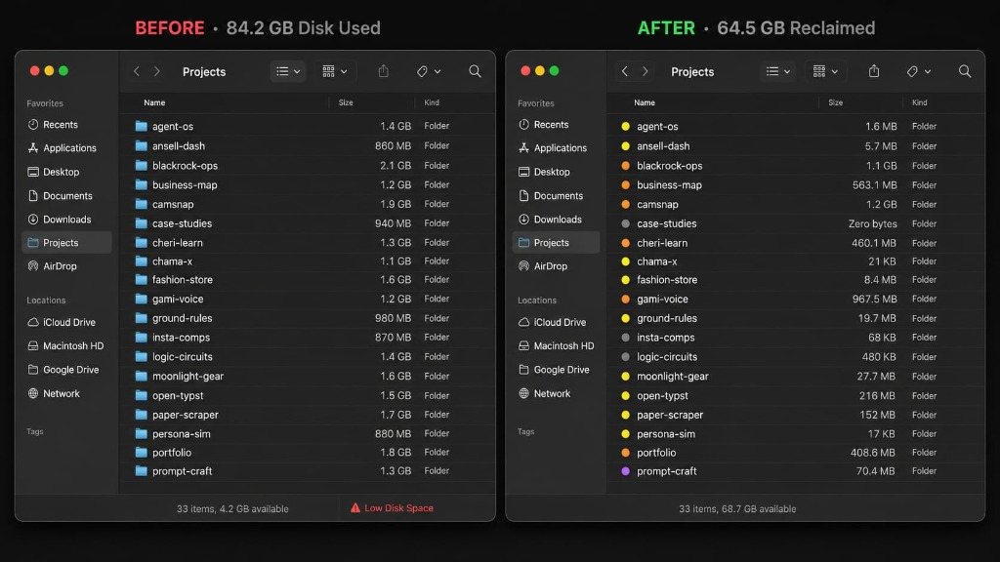
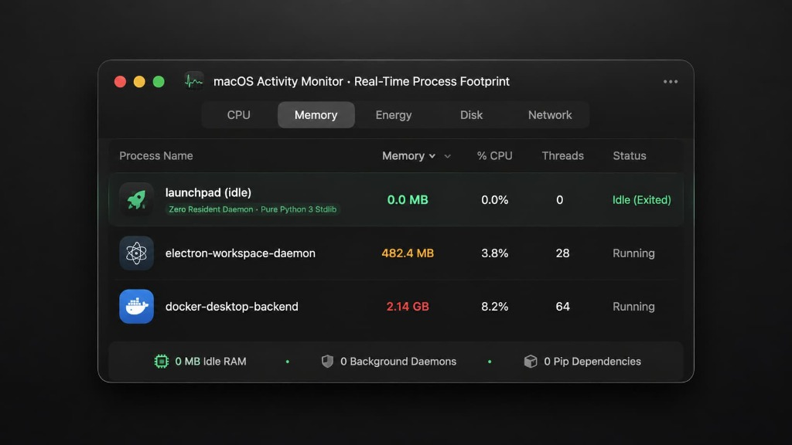
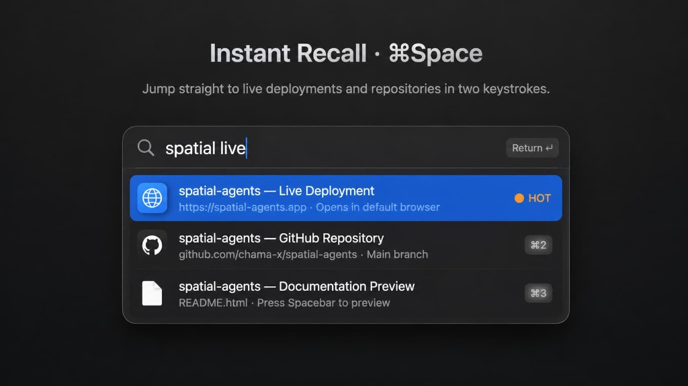
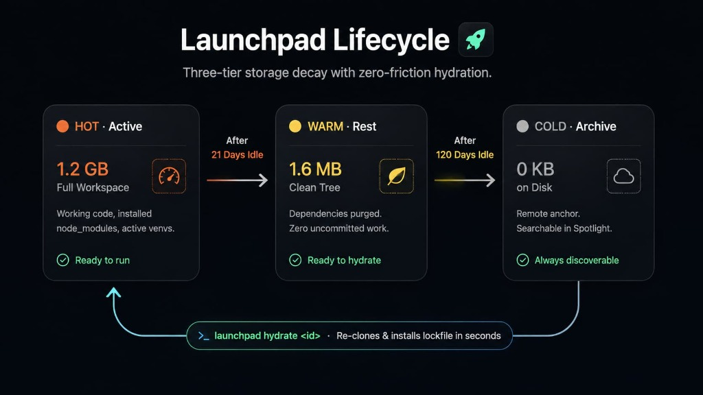
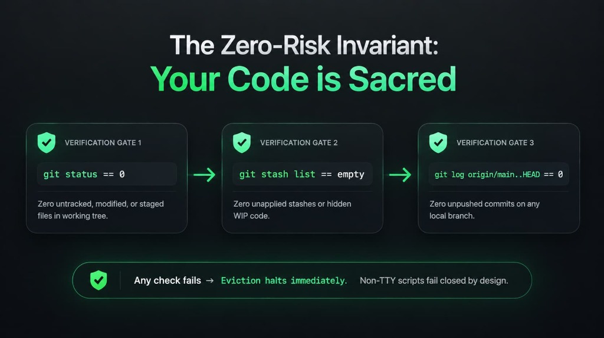

<div align="center">

# Launchpad

**Your repositories, natively integrated into macOS.**  
Launch live builds in two keystrokes. Reclaim gigabytes of idle disk space.  
*Zero resident daemons · 0 MB idle memory · Pure Python 3 standard library*

<br/>

```bash
# 1-Line Quick Install for macOS
curl -fsSL https://raw.githubusercontent.com/chama-x/launchpad/main/install.sh | bash
```

<br/>



</div>

---

## Zero Background Footprint

Traditional developer managers run heavy Electron apps or background Docker daemons. Launchpad turns macOS itself into your manager: commands execute in milliseconds and exit immediately. When idle, memory consumption is literally zero bytes.

<div align="center">
  
</div>

---

## Native Capabilities

### 1. Instant Recall (`⌘Space`)
Launchpad generates lightweight `.webloc` shortcut files inside a disposable `Launchpad/` index. macOS Spotlight indexes them automatically, opening live URLs or GitHub repos in two keystrokes.

<div align="center">
  
</div>

### 2. Readiness at a Glance (Finder Tags)
Launchpad writes native macOS extended attributes (`libc.setxattr`) directly to your project folders. When browsing Finder, runtime readiness and disk state are visible without opening a terminal.

<div align="center">
  
</div>

### 3. Spacebar Documentation Previews
Every indexed project includes a rendered `README.html`. Tapping **Spacebar** on any slot in Finder launches an instant macOS Quick Look preview with dark mode styling, zero editor launch required.

### 4. Adaptive Storage: "Fat when working, lean when resting"
Launchpad automatically scales projects down as they sit idle:

* **21 days idle:** Removes `node_modules` and build caches (`HOT` $\rightarrow$ `WARM`).
* **120 days idle:** Safely evicts the clean local clone (`WARM` $\rightarrow$ `COLD`), keeping the project discoverable in Spotlight.
* **Instant Hydration:** Run `launchpad hydrate <project>` (or right-click in Finder $\rightarrow$ **Quick Actions** $\rightarrow$ **Launchpad — Hydrate**) to re-clone and install frozen lockfiles in seconds.

---

## The Zero-Risk Guarantee: Your Code is Sacred

Launchpad will never delete, demote, or evict a project if:

1. `git status` shows untracked or modified files.
2. `git stash list` contains unapplied stashes.
3. `git log` shows unpushed commits on any local branch.

If any check fails, the project is flagged for attention and left untouched on disk.

Non-interactive `--force` calls (such as background scripts or automated AI tools) fail closed with exit code `1`. Force eviction strictly requires an interactive human in a terminal.

---

## Built for Humans. Engineered for Autonomous AI Agents.

Launchpad acts as the unified workspace bridge: humans navigate visually through Finder and Spotlight, while autonomous coding agents (Claude Code, Cursor, Gemini CLI, Antigravity) interact through structured machine protocols.

<div align="center">
  
</div>

* **`AGENTS.md` Workspace Contract:** Automatically placed at the workspace root (symlinked to `CLAUDE.md` and `GEMINI.md`) to establish rigid boundaries, safety rules, and CLI tools for AI agents.
* **Structured Context Cards:** Agents run `launchpad context <project>` to receive machine-readable JSON cards detailing runtime managers (`mise`, `volta`, `fnm`, `nvm`), lockfiles, and run recipes.
* **Collision-Free Port Allocator:** `launchpad run <project>` automatically probes port availability. If port 3000 is busy, it cleanly binds to `3001` with `PORT=3001`, preventing agent boot collisions.

---

## Terminal Experience & Command Reference

```bash
# Check workspace health, disk headroom, and project distribution
launchpad status

# Search across all local and remote indexed projects
launchpad search <query>

# Promote a cold project and install frozen dependencies
launchpad hydrate <project> [--hot]

# Start project on an auto-allocated collision-free port
launchpad run <project>

# Safely evict inactive project and reclaim disk space
launchpad evict <project>

# Protect a project permanently from automated decay
launchpad pin <project>

# Output machine-readable JSON context for AI tools
launchpad context <project>

# Reconcile metadata and upstream renames against GitHub
launchpad sync [--scan-local]

# System diagnostic report with privacy redaction mode
launchpad doctor [--redacted] [--json]
```

---

## Architecture & Separation

```
~/Projects/                      ← Workspace root ($LAUNCHPAD_HOME)
├── AGENTS.md                    ← Multi-agent contract (symlinked to CLAUDE.md & GEMINI.md)
├── .launchpad/                  ← Mode 0700 (Engine state — isolated from repos)
│   ├── manifest.json            ← Atomic state store (POSIX os.replace durability)
│   ├── config.json              ← Configurable thresholds and decay settings
│   ├── audit.jsonl              ← Append-only actor audit log
│   └── engine/launchpad.py      ← Pure Python 3 standard library engine
├── Launchpad/                   ← Generated human index (100% disposable)
│   └── <project>/
│       ├── <project> — Live.webloc
│       ├── <project> — GitHub.webloc
│       └── README.html
└── <project>/                   ← Pristine working trees (WARM / HOT)
```

---

## Verification

Launchpad includes a 20-test acceptance suite running in isolated temporary sandboxes with zero side-effects on your real system:

```bash
python3 tests/test_launchpad.py
```

Tested continuously on macOS 13, 14, and 15 (Sonoma & Sequoia) across Python 3.9 through 3.12.

---

## License

Released under the **[MIT License](LICENSE)**. Created and maintained by **[Chamath Thiwanka](https://github.com/chama-x)**.
