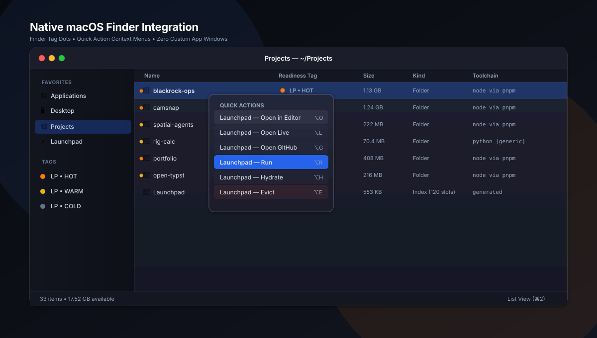

<div align="center">


<br/><br/>

# Launchpad

### Your projects in Finder and Spotlight.

**Zero background memory. Zero background CPU. Zero external dependencies.**

<br/>

```bash
# 1-Line Quick Install for macOS
curl -fsSL https://raw.githubusercontent.com/chama-x/launchpad/main/install.sh | bash
```

</div>

---

## How it works

Launchpad turns your macOS file system into an autonomous project manager:

* **Press `⌘Space`. Type `project live`. Hit Return.**  
  Your deployment opens in your default browser.
* **Look at Finder.**  
  Color tags show readiness: 🟠 HOT (installed), 🟡 WARM (clean git), ⚪️ COLD (0 KB on disk).
* **Tap Spacebar.**  
  Quick Look renders `README.html` without opening an editor.
* **Right-click any folder.**  
  Quick Actions let you hydrate, run, or evict projects directly from Finder.

---

<div align="center">
  
</div>

---

## Storage: Fat when working, lean when resting

Launchpad automatically sheds inactive dependencies to reclaim disk space:

<div align="center">
  
</div>

* **Inactivity Auto-Decay:** Projects demote from `HOT` $\rightarrow$ `WARM` (after 21 days idle) and `WARM` $\rightarrow$ `COLD` (after 120 days).
* **Instant Hydration:** Selecting **Hydrate** or running `launchpad hydrate <id>` clones the repo and executes frozen-lockfile installs in seconds.

---

## Safety: It will not delete your work

Eviction halts immediately if:
1. `git status` shows untracked or modified files.
2. `git stash list` is not empty.
3. `git log` contains unpushed commits on any local branch.

Automated scripts calling `--force` in non-interactive shells hard-fail by design.

---

## Built for AI agents

Autonomous tools (Claude Code, Cursor, Gemini CLI, Antigravity) navigate workspace boundaries deterministically:

* **`AGENTS.md` at root:** Standardized permission boundaries, toolchains, and rules.
* **Structured context:** `launchpad context <id>` outputs machine-readable JSON project cards.
* **Port collision prevention:** `launchpad run <id>` automatically allocates the next open port (`PORT=3001`).

---

<div align="center">
  
</div>

---

## Commands

```bash
launchpad status            # Inspect workspace health and disk headroom
launchpad hydrate <id>      # Promote cold project and install dependencies
launchpad run <id>          # Start dev server on auto-allocated port
launchpad evict <id>        # Safely reclaim disk space
launchpad pin <id>          # Protect project from automated decay
launchpad context <id>      # Output structured JSON for AI tools
launchpad doctor            # System diagnostic report
```

---

## Verification

```bash
python3 tests/test_launchpad.py    # 20 isolated sandbox acceptance tests
```

---

## License

Released under the **MIT License**. Created by **[Chamath Thiwanka](https://github.com/chama-x)**.
