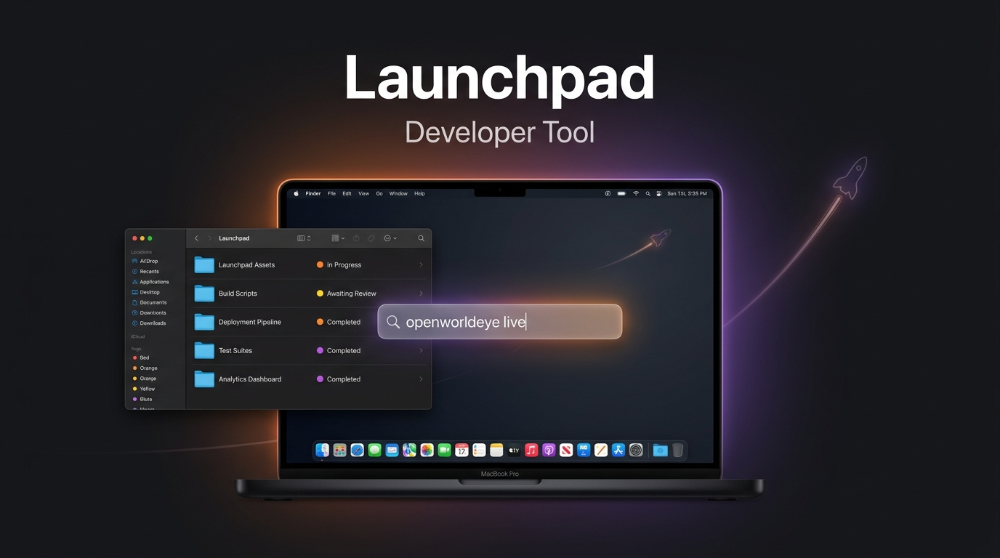
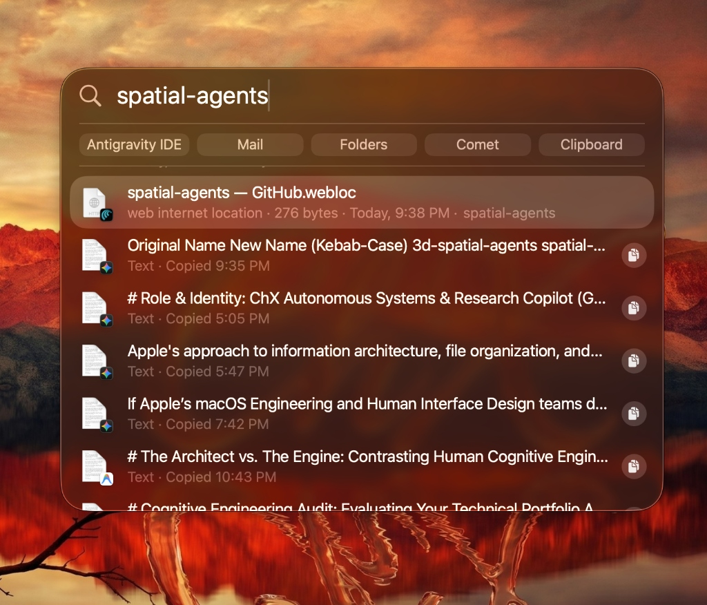
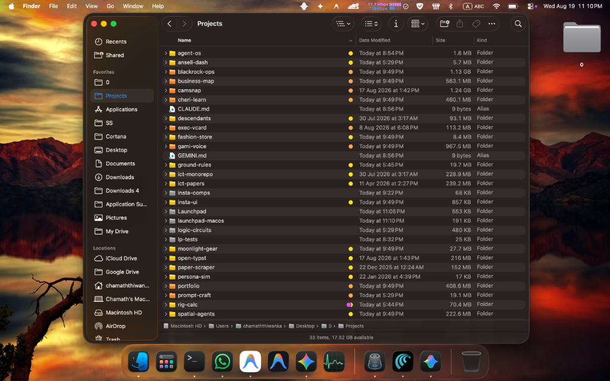
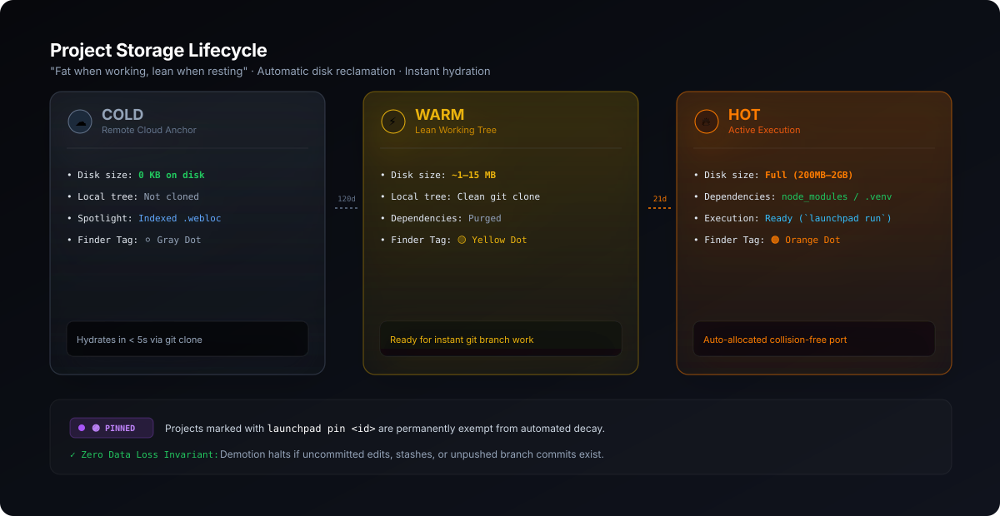
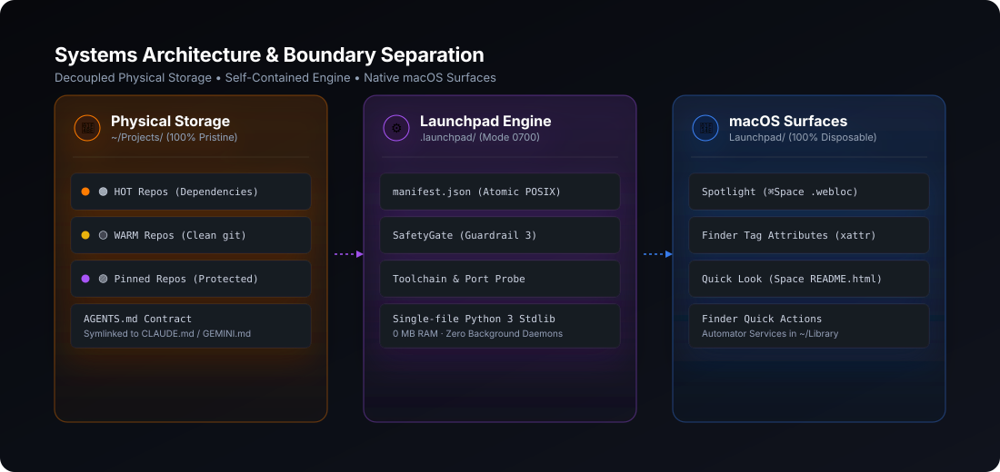

<div align="center">



<br/><br/>

# Launchpad

### The macOS-Native Workspace Engine for Developers &amp; AI Coding Agents

**Zero resident daemons. Zero memory footprint. Zero external dependencies.**  
**Make the macOS file system itself your launcher, status board, and storage lifecycle manager.**

<br/>

[](https://github.com/chama-x/launchpad)
[](https://github.com/chama-x/launchpad)
[](https://github.com/chama-x/launchpad)
[](https://github.com/chama-x/launchpad)
[](LICENSE)

<br/>

</div>

---

## ⚡ Quick Start (1-Line Install)

Run this single command in your macOS Terminal:

```bash
curl -fsSL https://raw.githubusercontent.com/chama-x/launchpad/main/install.sh | bash
```

> **💡 How it works**: The installer will prompt you to confirm your workspace folder (e.g. `~/Projects` or `~/Developer`). You can simply press **Return** to accept the auto-detected location, or **drag & drop** any folder from Finder directly into your terminal.

<details>
<summary><b>🛠️ Advanced: Non-Interactive / Custom Directory Install</b></summary>
<br/>

If you want to install directly to a specific folder without any interactive prompt (useful for scripts or CI):

```bash
# Pass your projects folder as an argument
curl -fsSL https://raw.githubusercontent.com/chama-x/launchpad/main/install.sh | bash -s -- ~/Developer
```
</details>

---

## 💡 The Core Idea: The File System IS the UI

Most developer tools sell you another 300MB Electron app, a background Docker daemon eating 4GB of RAM, or a custom web dashboard you must keep running.

**Launchpad turns macOS itself into your developer dashboard:**

1. **⌘Space is your Launcher**: Type 3 letters of any project + `live` or `github`, hit **Return**, and your browser opens instantly.
2. **Finder is your Status Board**: Every project folder has a native macOS color tag showing runtime readiness (`🟠 HOT`, `🟡 WARM`, `⚪️ COLD`, `🟣 Pinned`).
3. **Spacebar is your Documentation**: Tap Spacebar on `README.html` for a styled Quick Look preview without opening an editor.
4. **Right-Click is your Control Center**: Right-click any folder $\rightarrow$ **Quick Actions** $\rightarrow$ *Run*, *Hydrate*, or *Evict*.
5. **Zero Background Footprint**: Consumes **0% CPU and 0 MB RAM** while idle. Commands run in milliseconds via pure Python 3 stdlib and exit immediately.

---

<div align="center">
  
</div>

---

## 🚀 Key Features

### 1. Instant Recall via Spotlight (`⌘Space`)
Launchpad generates lightweight native `.webloc` shortcuts inside a disposable index (`Launchpad/`). macOS Spotlight indexes them automatically:
* `⌘Space` $\rightarrow$ `openworldeye live` $\rightarrow$ `Return` $\rightarrow$ Opens deployed production app in your browser.
* `⌘Space` $\rightarrow$ `spatial-agents github` $\rightarrow$ `Return` $\rightarrow$ Opens GitHub repository.
* `⌘Space` $\rightarrow$ `README.html` $\rightarrow$ `Spacebar` $\rightarrow$ Instant Quick Look preview.

<div align="center">
  
</div>

---

### 2. Native Finder Readiness Tags & Context Actions
Finder color tags are written natively via `libc.setxattr` on `com.apple.metadata:_kMDItemUserTags`:
* **🟠 `LP · HOT`**: Materialized project with active dependencies (`node_modules`, `.venv`). Ready to run immediately.
* **🟡 `LP · WARM`**: Lean commit tree with no dependencies. Pristine git clone ready for work (~1–15 MB).
* **⚪️ `LP · COLD`**: Remote repository metadata only. Consumes **0 KB on disk** until hydrated.
* **🟣 `LP · Pinned`**: Local-only or critical projects permanently immune to decay.

<div align="center">
  
</div>

---

### 3. Adaptive Storage: "Fat When Working, Lean When Resting"

Modern development creates massive dependency bloat—holding 20GB+ of inactive `node_modules` and compilation caches. Launchpad dynamically scales projects down as they sit idle:

<div align="center">
  
</div>

* **21 Days Idle (`HOT` $\rightarrow$ `WARM`)**: Automatically purges `node_modules` and build caches, reclaiming 95%+ disk space.
* **120 Days Idle (`WARM` $\rightarrow$ `COLD`)**: Safely evicts clean clones, keeping them searchable in Spotlight.
* **Instant Hydration**: Run `launchpad hydrate <id> --hot` (or right-click $\rightarrow$ *Launchpad — Hydrate*) to clone and execute frozen-lockfile installs in seconds.

---

### 4. The Zero-Risk Safety Guarantee: Your Code is Sacred

Launchpad strictly verifies cleanliness before any eviction:
1. **Uncommitted Changes**: Checks `git status --porcelain` is 100% clean.
2. **Stashes**: Verifies `git stash list` is empty.
3. **Unpushed Commits**: Audits `git log --branches --not --remotes` to guarantee **no unpushed commits exist on any local branch**.

> **🛡️ Non-TTY Structural Block**: Automated scripts and AI agents calling `launchpad evict <id> --force` in non-interactive shells **hard-fail with exit code 1**. Force eviction strictly requires an interactive human.

---

### 5. Built for Humans. Engineered for Autonomous AI Agents.

Launchpad acts as the universal workspace bridge: humans navigate visually through Finder and Spotlight, while autonomous coding agents (Claude Code, Gemini CLI, Cursor, Antigravity, OpenHands) interact through structured machine protocols:

<div align="center">
  
</div>

* **`AGENTS.md` Workspace Contract**: Placed at workspace root (symlinked to `CLAUDE.md` and `GEMINI.md`) to establish rigid boundaries, safety invariants, and available CLI tools.
* **Structured Context Cards**: Agents run `launchpad context <id>` to receive machine-readable JSON cards detailing runtime managers (`mise`, `volta`, `fnm`, `nvm`), lockfiles, and run scripts.
* **Collision-Free Port Allocator**: `launchpad run <id>` automatically probes port availability. If port 3000 is busy, it cleanly binds to `3001` (`PORT=3001`), preventing server boot collisions.

---

## 📊 Comparison Matrix

| Feature | Launchpad v2 | Docker / DevContainers | PM2 / Resident Daemons | Electron / Custom GUI |
|---|:---:|:---:|:---:|:---:|
| **Idle RAM Overhead** | **0 MB** | 1.5 – 4.0 GB | 150 – 400 MB | 300 – 800 MB |
| **Idle CPU Usage** | **0.0%** | 2 – 8% | 1 – 3% | 0.5 – 2% |
| **External Dependencies** | **Zero (Stdlib Only)** | Docker Desktop | Node.js + NPM | Build Toolchains |
| **Finder / Spotlight Integration** | **Native** | None | None | Limited |
| **Spacebar Quick Look HTML** | **Yes** | No | No | No |
| **Unpushed Branch Protection** | **Strict Audit** | No | No | No |
| **Multi-Agent Harness Contract** | **Built-in** | Manual | No | No |

---

## 🛠️ CLI Command Reference

```bash
# Check workspace health, disk headroom, and project distribution
launchpad status

# Search across all local and remote indexed projects
launchpad search <query>

# Promote a cold project and install frozen dependencies
launchpad hydrate <project-id> [--hot]

# Start project on an auto-allocated collision-free port
launchpad run <project-id>

# Safely evict inactive project and reclaim disk space
launchpad evict <project-id>

# Protect a project permanently from automated decay
launchpad pin <project-id>

# Output machine-readable JSON context for AI agents
launchpad context <project-id>

# Reconcile metadata and upstream renames against GitHub
launchpad sync [--scan-local]

# System diagnostic report with privacy redaction mode
launchpad doctor [--redacted] [--json]
```

---

## 🧪 Testing & CI

Launchpad includes an automated 20-test acceptance suite running in isolated temporary sandboxes with zero side-effects on your real system:

```bash
# Run unit & integration tests
python3 tests/test_launchpad.py
```

Tested continuously on **macOS 13, 14, and 15 (Sonoma & Sequoia)** across Python 3.9 through 3.12.

---

## 📄 License & Maintainer

Created and maintained by **[Chamath Thiwanka](https://github.com/chama-x)**.  
Released under the **[MIT License](LICENSE)**.
